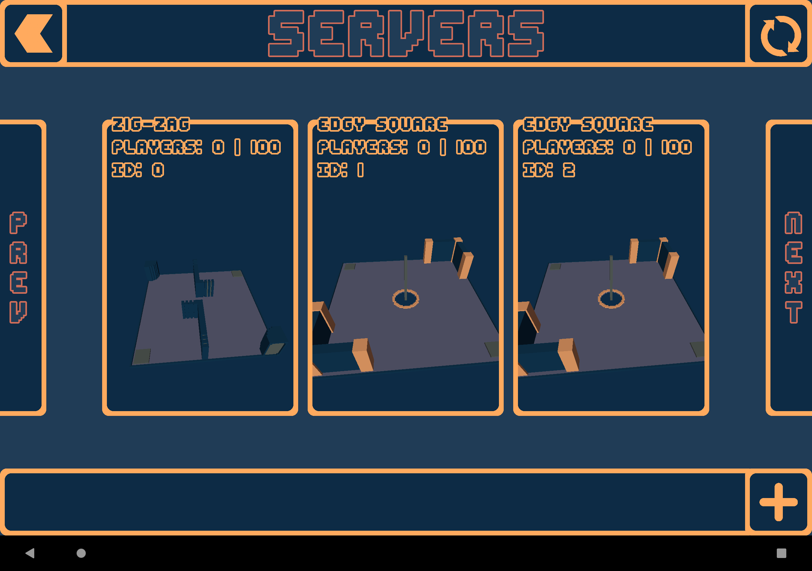
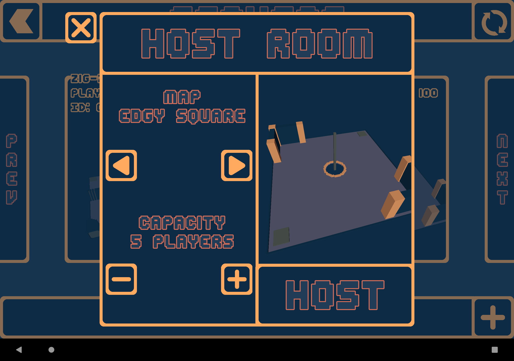
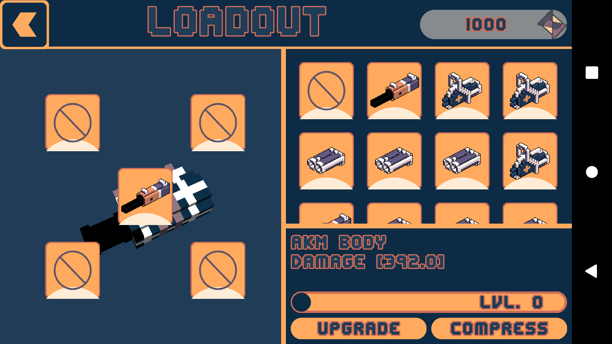
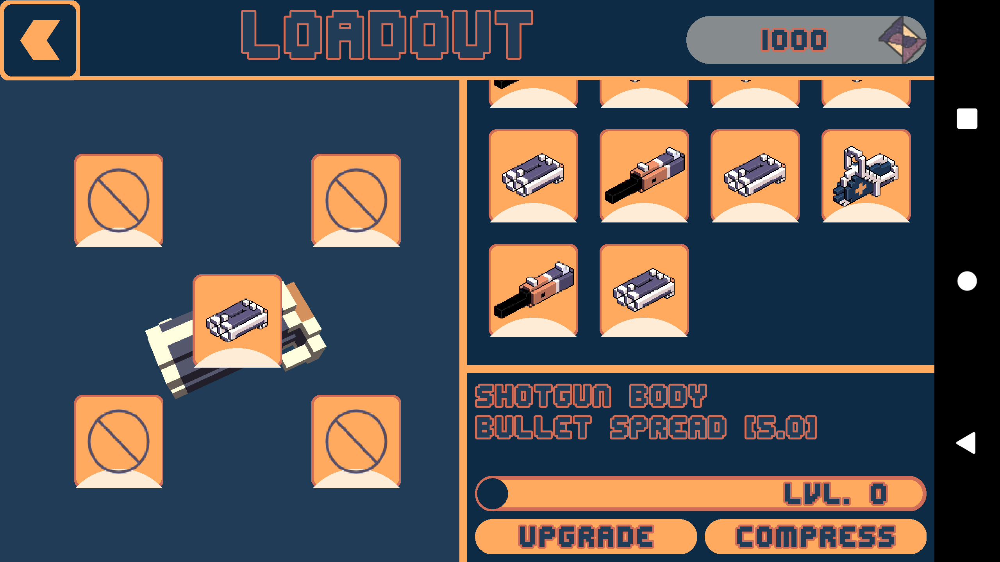
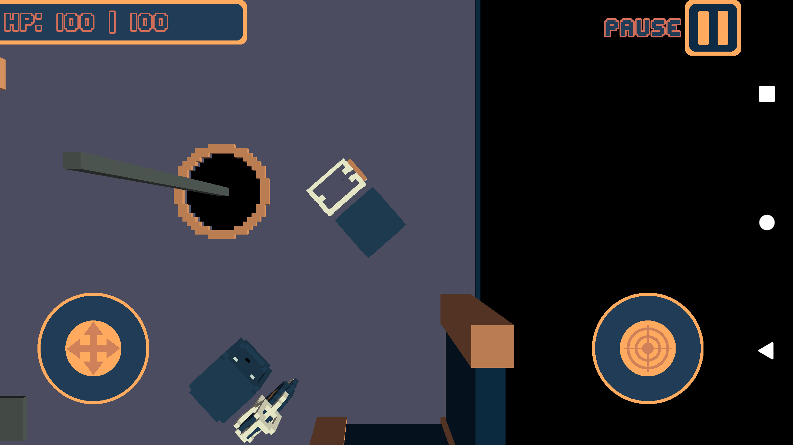
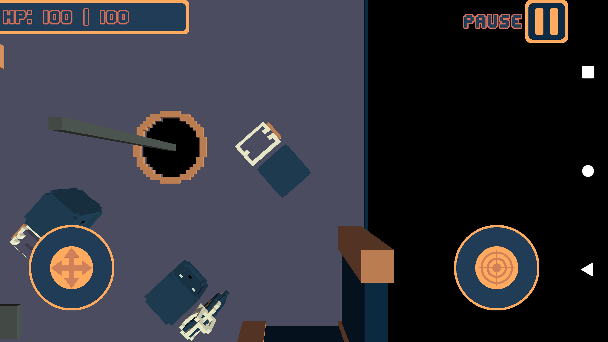

<h1 align="left">
      
    Mad Cubes
</h1>

A multiplayer shooter game where players build their weapons from different modules.

## The story

This game was created in mid 2021 as a school project. At the time I didn't know how to properly use Git, therefore there is a lot of commented out code and backup copies of different files.

The multiplayer implementation is rather questionable too, since clients infinitely spam the server with requests to update their state.

Also, at the time I didn't know about LibGDX's UI system (Stage and Actors), so I used ShapeRenderers and Sprites to create most of the UI.

## Gallery

> 🎥 Check out the video demo [here](https://media.githubusercontent.com/media/Smooth-E/mad-cubes/master/media/Showcase.mp4)

    
    
    
    
    
    

## Building and playing

You can build this project using Gradle. If you are to use Android Studio, keep in mind that I did not upgrade the AGP and Gradle itself from the last time I touched the project. Therefore, you might need to upgrade them yourself or use an older version of Android Studio.

You can start the server from a .jar file you compiled. Paste you server's address (or a URL) into [MultiplayerSample.java](https://github.com/Smooth-E/mad-cubes/blob/master/client/core/src/main/java/com/simple/madqubies/MultiplayerSample.java#LL94C35-L94C48). When done, compile the Android client using Gradle, as described above.

## License

The code is licensed under [GNU AGPL 3.0](license), graphical and audio assets are not redistributable. This repository might contain assets that I don't own (e.g. libraries I downloaded just for test and forgot to remove), feel free to report in [Issues](https://github.com/Smooth-E/mad-cubes/issues) if you find any.
